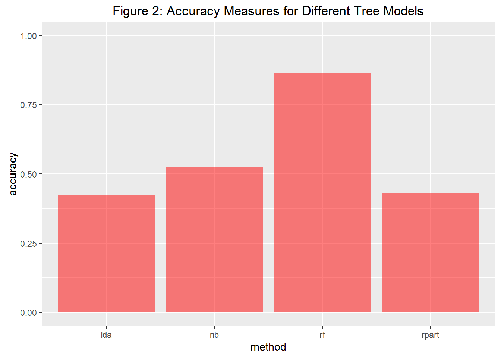

# Synopsis
This paper constructs four models to predict how well test subjects perform a specific excercise.
We partition a training data set into a training partition and a validation partition.
Using the training partition, we construct a model for each of the Decision Tree, Random Forest, Linear Discriminent Analysis and Naive Bayes training methods.
We then compute the accurarcy of each model against the validation partition of the Training data set.
Finally we use the model with the highest accuracy to predict the response variable of the Test data set.

# Data

The data for this study comes from the paper mentioned in the Citations section below.  The data consists of a training data set and a test data set.

## Acquistion of the Data

See Appendix 1 for the R code that downloads the training and test data sets into the current working directory.

The R command below will load the training data set into the current R session.
The training data file has many divide by zero strings and missing values so those are mapped to the value `NA`.

```r
training <- read.csv("pml-training.csv", na.strings = c("NA","#DIV/0!",""))
```

## Reduction of the Training Data Set
Visual inspection of the `plm-training.csv` file reveals that the data is organized by a variable named num_window.
This variable ranges from 1 to 864.
Rows in the data set corresponding to a specific num_window value appear to be the sensor readings for a particular test case: e.g. user Pedro performing the arm curl exercise in the 'C' manner for the j^th^ time.

To predict how well a user is performing the exercise, we need to estimate a model using summary measures from each of the test cases.
The study authors built features using 8 summary measures: min, max, mean, standard deviation, variance, kurtosis, skew and amplitude.
In interest of time, this study uses just the mean of each sensors' yaw, roll, pitch and total acceleration readings.

The following R code reduces the data to the means within the num_window for roll, pitch, yaw and total acceleration for the 4 sensor locations: forearm, arm, belt and dumbbell:

```r
#summarize the data within the windows
win.means = aggregate(data=training,
      cbind(roll_dumbbell, pitch_dumbbell, yaw_dumbbell, total_accel_dumbbell,
            roll_belt,     pitch_belt,     yaw_belt,     total_accel_belt,
            roll_arm,      pitch_arm,      yaw_arm,      total_accel_arm,
            roll_forearm,  pitch_forearm,  yaw_forearm,  total_accel_forearm)~user_name+classe + num_window,
                      FUN=mean)
dim(win.means)
```

```
## [1] 858  19
```

## Partitioning the Validation Data
Further partitioning of the training data.frame, now reduced into the `win.means` data.frame allows us to  avoid over-fitting and preserves our ability to estimate out-of-sample prediction accuracy.
Essentially, we'll break the `win.means` data into two pieces, estimate four machine learning models on the first piece and validate the four models against the second piece.
Notice in this estimate/validate cycle, the real test data set is left untouched and all of the validation is performed on a subset of the training data.

Here's the R code to form the partitions:

```r
library(caret)

set.seed(1234)

#save off some of the training data for use in validation
inTrain <- createDataPartition(y=win.means$classe, p=0.8, list=FALSE)
win.train <- win.means[inTrain,]
win.val <- win.means[-inTrain,]

dim(win.train); dim(win.val)
```

```
## [1] 688  19
```

```
## [1] 170  19
```

# Exploratory Data Analysis

Figure 1 below shows a density plot of total acceleration at each of the four sensor locations.
The y-axis represents the percentage of test cases at any value along the x-axis and the colors represent the different methods (classe) of performing the arm curl exercise.

Two features are striking about Figure 1.
First is the bimodal nature of the belt sensor readings. For whatever reason, test subjects accelerated their belts either very little or very much but not much in between.
Given the overlap in colors, the classe doesn't appear to determine which mode the test subject is in.

The second striking feature in Figure 1 is that modal peaks of the classes are highly overlapped.
This suggests that total acceleration by itself at any of the sensor locations will be a poor predictor of the classe variable.

Figure 1 omits the other summary measures of roll, pitch and yaw.
In the interest of brevity, we're not going to show the other measures (12 additional graphs!)
Given that total acceleration by itself won't predict classe, there must be some interaction among the 16 features that will explain the classe variable.
We'll explore these interactions in the next section.
See Appendix 2 for the R code that produces Figure 1.


# Model Selection
The goal of this exercise is to predict from the sensor readings in which of the 5 methods the user is doing the arm curl.
Since the method, represented by the `classe` variable in the dataset is discreet, we will explore  4 tree prediction algorithms: Classification Tree (caret method "rpart"),
Random Forest (caret method "rf"), Linear Discriminant Analysis (caret method "lda") and Naive Bayes (caret method "nb").
We'll calculate the Accuracy measure on the validation partition of the training data set and pick the model with the highest accuracy to use for predicting the test data set.
To do accomplish this we will first create a formula string for use in all training invocations, create a 'trained' model for each of the four algorithms, create a Confusion Matrix using each model's prediction on the validation training data set and finally examine the Accuracy measure for each model.

## Create the formula string

Appendix 3 contains R code to build up the formula string that we will use in each of the model training runs.
Only the resulting string in the workspace variable `fmla` is shown here for brevity:


```r
print(fmla)
```

```
## classe ~ pitch_arm + roll_arm + yaw_arm + total_accel_arm + pitch_belt + 
##     roll_belt + yaw_belt + total_accel_belt + pitch_forearm + 
##     roll_forearm + yaw_forearm + total_accel_forearm + pitch_dumbbell + 
##     roll_dumbbell + yaw_dumbbell + total_accel_dumbbell
```

## Fit the Models
The R code below fits models using the four methods using the training partition (as opposed to the validation partition) of the Training dataset.
It stores the fitted models in a list variable called `modfits` which is indexed by the training method.

```r
#model types
methods=c("rpart","rf","lda", "nb")
f<-function(x)train(fmla, data=win.train, method=x)

#fit the four models
modfits=sapply(methods, f, simplify=FALSE)
names(modfits)=methods
```

## Generate Confusion Matrices and Collect Accuracy Measures
Using the validation partition of the Training dataset, this code computes Confusion Matrices for each of the four fitted models.
It then retrieves the Accuracy measure from each Confustion Matrix and stores the measure in the variable `acc`.

```r
#generate confusion matrices for each of the four models
cfm <- function(x){confusionMatrix(predict(x, newdata=win.val), win.val$classe)}
cfms <- lapply(modfits, cfm)

#retrieve the Accuracy summary measure from the Confusion Matrix for each of the models
getaccuracy <- function(cfm){cfm$overall["Accuracy"]}
acc <- sapply(cfms, getaccuracy)
```

## Examine Each Model's Accuracy Result
Figure 2 below shows the Accuracy results for each of the four methods.  As the Figure shows, the Random Forest method has by far the greatest acurracy of 0.865.
The R code for this plot is in Appendix 4.



Here is the Confusion Matrix for the Random Forest model.  It appears as if the model predicts classe A very accurately (doing the Arm Curl exercise correctly) and which of the four incorrect ways (classes B, C, D and E) not as well.

```r
cfms["rf"]$rf$table
```

```
##           Reference
## Prediction  A  B  C  D  E
##          A 47  6  0  2  0
##          B  1 24  1  1  4
##          C  0  2 27  1  0
##          D  0  0  1 23  1
##          E  0  1  1  1 26
```
Below is the relative importance of the predictors:

```r
varImp(modfits[["rf"]])
```

```
## rf variable importance
## 
##                      Overall
## roll_belt            100.000
## roll_dumbbell         64.077
## total_accel_belt      56.177
## yaw_belt              55.934
## pitch_forearm         54.917
## pitch_belt            47.089
## total_accel_dumbbell  39.960
## pitch_dumbbell        32.779
## yaw_dumbbell          31.207
## roll_arm              23.997
## roll_forearm          14.092
## total_accel_arm        8.842
## total_accel_forearm    8.623
## yaw_arm                6.585
## yaw_forearm            6.079
## pitch_arm              0.000
```

# Predictions with the Test Data
And now...the moment we've all be waiting for: using the Test data set to make the prediction.

In the previous section, the Random Forest model exhibited the highest accurary in predicting the validation partition of the training data set.
So that will be the model that we will use in making predictions from the Testing data set.
The R code below loads in the Test data set and provides it as input to the Random Forest model.

```r
testing <- read.csv("pml-testing.csv", na.strings = c("NA","#DIV/0!",""))
predict(modfits[["rf"]], newdata = testing)
```

```
##  [1] C A A A A E D D A A A C E A E E A B B B
## Levels: A B C D E
```

There you have it!!

#Conclusion

In this paper, we constructed four models to predict how well test subjects performed an exercise. We found that the Random Forest model produced the highest accuracy on the validation partition of the training dataset and therefore used that model to predict on the Test dataset.

# Citation
The data in this study comes from this paper:

Velloso, E.; Bulling, A.; Gellersen, H.; Ugulino, W.; Fuks, H.
**Qualitative Activity Recognition of Weight Lifting Exercises.**
Proceedings of 4th International Conference in Cooperation with SIGCHI (Augmented Human '13) . Stuttgart, Germany: ACM SIGCHI, 2013.

Paper is [here.](http://groupware.les.inf.puc-rio.br/har#wle_paper_section#ixzz43l97CAN9)

## Appendix 1: Download the Data Sets

These commands will download the training and test data sets into the current working directory.

```r
netpath <- "https://d396qusza40orc.cloudfront.net/predmachlearn"

f <- "pml-testing.csv"
download.file(paste(netpath,f,sep = "/"),destfile = f)

f <- "pml-testing.csv"
download.file(paste(netpath,f,sep = "/"),destfile = f)
```

# Appendix 2: R Code for Figure 1


```r
library(ggplot2)

plothist <- function(){
  
  df = data.frame(where = rep(c("Belt","Dumbbell","Forearm","Arm"), each=nrow(win.train)),
                  classe = rep(win.train$classe, 4),
                  val = c(win.train$total_accel_belt, win.train$total_accel_dumbbell,
                          win.train$total_accel_forearm, win.train$total_accel_arm))
  ggplot(aes(val, fill=classe), data=df) +
    facet_grid(.~where, scales="free")+
    geom_density(alpha=0.3) +
    labs(x="Total Acceleration",title="Figure 1: Acceleration Density Plot at Four Sensor Locations")
}

plothist()
```

# Appendix 3: R Code to Create Model Formula

```r
locs = c("arm", "belt", "forearm","dumbbell") # sensor locations
meas = c("pitch","roll", "yaw", "total_accel" ) # sensor summary measures

## create list of column names, measures by location
vnames = paste( rep(meas,length(locs)), rep(locs, each=length(meas)), sep="_")

##build up a formula to pass to subsequent train invocations
fmla <- as.formula(paste("classe ~ ", paste(vnames, collapse= " + ")))
```

# Appendix 4: R Code for Figure 2

```r
dacc=data.frame(method=methods, accuracy=acc)
ggplot(data=dacc, aes(x=method,y=accuracy))+
  geom_bar(stat="identity",fill="red", alpha=0.5)+
  ylim(0,1)+
  labs(title = "Figure 2: Accuracy Measures for Different Tree Models")
```
